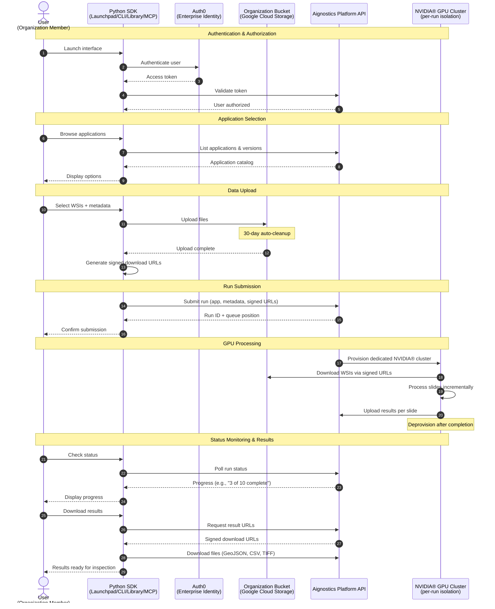

[//]: # (README.md generated from docs/partials/README_*.md)

# 🔬Aignostics Python SDK

[](https://github.com/aignostics/python-sdk/blob/main/LICENSE)
[](https://pypi.org/project/aignostics/)
[](https://github.com/aignostics/python-sdk/actions/workflows/ci-cd.yml)
[](https://aignostics.readthedocs.io/en/latest/)
[](https://sonarcloud.io/summary/new_code?id=aignostics_python-sdk)
[](https://sonarcloud.io/summary/new_code?id=aignostics_python-sdk)
[](https://sonarcloud.io/summary/new_code?id=aignostics_python-sdk)
[](https://codecov.io/gh/aignostics/python-sdk)
[](https://aignostics.betteruptime.com)


## Introduction

The **Aignostics Platform** runs computational pathology applications — such as [Atlas H&E-TME](https://www.aignostics.com/products/he-tme-profiling-product), which analyzes the tumor microenvironment in H&E-stained tissue — on your whole slide images. The **Aignostics Python SDK** is how you work with it, through the interfaces below.

## Choose your interface

Choose your preferred interface for working with the Aignostics Platform. Each interface is designed for different user roles and use cases:

### 🖥️ Launchpad (Desktop Application)

| | |
|---|---|
| **What it is** | Graphical application for analyzing slides and viewing results in QuPath or Python notebooks |
| **Best for** | Pathologists and researchers who want to analyze slides without writing code |
| **Use when** | Running analyses on individual cases or small cohorts (1-20 slides) and exploring results interactively |
| **Get started** | <a href="https://aignostics.readthedocs.io/en/latest/get_started_launchpad.html">Get started with Launchpad</a> |

### 🌐 Console (Web Interface)

| | |
|---|---|
| **What it is** | Web interface at [platform.aignostics.com](https://platform.aignostics.com) for creating and monitoring analyses in your browser, combined with a single Python SDK command to upload your slides |
| **Best for** | Pathologists and researchers who prefer working in a browser and want the least software to install |
| **Use when** | Analyzing slides that are already on your computer or file server (1-100s of slides), without installing a desktop application |
| **Get started** | <a href="https://aignostics.readthedocs.io/en/latest/get_started_console.html">Get started with Console</a> |

### ⌨️ CLI (Command-Line Interface)

| | |
|---|---|
| **What it is** | Terminal tool for scripting and automation |
| **Best for** | Bioinformaticians and technical researchers who work with terminal-based workflows |
| **Use when** | Processing large cohorts (10s-100s of slides), automating repetitive analyses, or integrating with computational pipelines |
| **Get started** | <a href="https://aignostics.readthedocs.io/en/latest/get_started_cli.html">Get started with the CLI</a> |

### 📚 Python Library

| | |
|---|---|
| **What it is** | Python library for programmatic access in scripts, notebooks, and applications |
| **Best for** | Data scientists and developers who want to integrate the platform into Python-based workflows |
| **Use when** | Building custom analysis pipeline in Python for repeated usage and processing large datasets (10s-1000s of slides) |
| **Get started** | <a href="https://aignostics.readthedocs.io/en/latest/get_started_library.html">Get started with the Python Library</a> |

### 🔌 REST API (Direct HTTP)

| | |
|---|---|
| **What it is** | The Platform's REST API at `https://platform.aignostics.com/api/v1`, called directly over HTTPS |
| **Best for** | Developers integrating from another language or an existing pipeline, without depending on the Python SDK |
| **Use when** | Building a service or workflow outside Python, or generating your own client from the OpenAPI document |
| **Get started** | <a href="https://aignostics.readthedocs.io/en/latest/get_started_api.html">Get started with the API</a> |

<!-- Hidden for now: the MCP server is not yet usable for customers. Restore this row
     together with the guide's toctree entry and conf.py exclusion.

### 🤖 MCP Server (AI Agent Integration)

| | |
|---|---|
| **What it is** | Model Context Protocol server that exposes SDK functionality to AI agents like Claude |
| **Best for** | Users who want AI assistants to help with platform operations |
| **Use when** | Working with Claude Desktop or other MCP-compatible AI tools to manage datasets, submit runs, or query results |
| **Get started** | <a href="https://aignostics.readthedocs.io/en/latest/get_started_mcp.html">Get started with the MCP Server</a> |
-->

> 💡 Each interface has its own step-by-step guide (linked above) that includes installation. Launchpad and the CLI handle authentication for you; the Python Library guide covers credential setup.

## Next Steps

The best next step is to **run your first analysis** end to end.

New here? Start with the [Get started with Launchpad](https://aignostics.readthedocs.io/en/latest/get_started_launchpad.html) guide — it walks you through signing up, installing, and running [Atlas H&E-TME](https://www.aignostics.com/products/he-tme-profiling-product) on a public example slide, then viewing the results in QuPath, with no coding required. Prefer the terminal or Python? Use the [Get started with the CLI](https://aignostics.readthedocs.io/en/latest/get_started_cli.html) or [Get started with the Python Library](https://aignostics.readthedocs.io/en/latest/get_started_library.html) guide instead.

Once you've run your first analysis:

- **Understand the platform**: Read the [Aignostics Platform Overview](https://aignostics.readthedocs.io/en/latest/platform_overview.html) for architecture and core concepts.
- **Go deeper**: See the [CLI reference](https://aignostics.readthedocs.io/en/latest/cli_reference.html) and [Python Library reference](https://aignostics.readthedocs.io/en/latest/lib_reference.html).
- **Get support**: Contact [support@aignostics.com](mailto:support@aignostics.com) or browse the [full documentation](https://aignostics.readthedocs.io/en/latest/).

## We take quality and security seriously

We know you take **quality** and **security** as seriously as we do. That's why
the Aignostics Python SDK is built following best practices and with full
transparency. This includes (1) making the complete
[source code of the SDK
available on GitHub](https://github.com/aignostics/python-sdk/), maintaining a
(2)
[A-grade code quality](https://sonarcloud.io/summary/new_code?id=aignostics_python-sdk)
with [high test coverage](https://app.codecov.io/gh/aignostics/python-sdk) in
all releases, (3) achieving
[A-grade security](https://sonarcloud.io/summary/new_code?id=aignostics_python-sdk)
with
[active scanning of dependencies](https://github.com/aignostics/python-sdk/issues/4),
and (4) providing
[extensive documentation](https://aignostics.readthedocs.io/en/latest/). Read
more about how we achieve
[operational excellence](https://aignostics.readthedocs.io/en/latest/operational_excellence.html) and
[security](https://aignostics.readthedocs.io/en/latest/security.html).


## Platform

### Overview

The **Aignostics Platform** is a comprehensive cloud-based service that allows organizations to leverage advanced computational pathology applications without the need for specialized expertise or complex infrastructure. Via its API it provides a standardized, secure interface for accessing Aignostics' portfolio of advanced computational pathology applications. These applications perform machine learning based tissue and cell analysis on histopathology slides, delivering quantitative measurements, visual representations, and detailed statistical data.


### Key Features
Aignostics Platform offers key features designed to maximize value for its users:

1. **Run Aignostics applications:** Run Aignostics advanced computational pathology applications like [Atlas H&E-TME](https://www.aignostics.com/products/he-tme-profiling-product) on your whole slide images (WSIs) and receive results in a easy to inspect formats.
2. **Multiple Access Points:** Interact with the platform via various pathways, from **Aignostics Launchpad** (desktop application for MacOS, Windows and Linux), **Aignostics CLI** (command-line interface for your terminal or shell scripts), **Example Notebooks** (we support Jupyter and Marimo), **Aignostics Client Library** (for integration with your Python codebase), or directly through the **API of the Aignostics Platform** (for integration with any programming language). Contact your business partner at Aignostics if you are interested to discuss a direct integration with your Imaging Management Systems (IMS) and Laboratory Information Management Systems (LIMS).
3. **Secure Data Handling:** Maintain control of your slide data through secure self-signed URLs. Results are automatically deleted after 30 days, and can be deleted earlier by the user.
4. **High-throughput processing with incremental results delivery:** Submit up to 500 whole slide images (WSI) in one batch request. Access results for individual slides as they completed processing, without having to wait for the entire batch to finish.
5. **Standard formats:** Support for commonly used image formats in digital pathology such as pyramidal DICOM, TIFF, and SVS. Results provided in standard formats like QuPath GeoJSON (polygons), TIFF (heatmaps) and CSV (measurements and statistics).

### Registration and User Access

To start using the Aignostics Platform and its advanced applications, your organization must be registered by our business support team:

1. Access to the Aignostics Platform requires a formal business agreement. Once an agreement is in place between your organization and Aignostics, we proceed with your organization's registration. If your organization does not yet have an account, please contact your account manager or email us at [support@aignostics.com](mailto:support@aignostics.com) to express your interest.
2. To register your organization, we require the name and email address of at least one employee, who will be assigned the Administrator role for your organisation. Your organisation's Administrator can invite and manage additional users. 

> [!Important]
> 1. All user accounts must be associated with your organization's official domain. We do not support the registration of private or personal email addresses.
> 2. For security, Two-Factor Authentication (2FA) is mandatory for all user accounts.
> 3. We can integrate with your IDP system (e.g. SAML, OIDC) for user authentication. Please contact us to discuss the integration.
> 4. Registering your organistation typically takes 2 business days depending on the complexity of the signed business agreement and specific requirements.

### Console

The web-based [*Aignostics Console*](https://platform.aignostics.com) is a user-friendly interface that allows you to 
manage your organization, applications, quotas, and users registered with the Aignostics Platform.

1. The Console is available to users registered for your organisation to manage their profile and monitor usage of their quota.
2. Administrators of your organization can invite additional users, manage the organisation and user specific quotas and monitor usage.
3. Both roles can trigger application runs.

#### Inviting and managing users

If you have the Administrator role, you invite colleagues to your organization directly from the Console:

1. Log in to the [Console](https://platform.aignostics.com) and select **Admin** in the sidebar, then open **Members**.
2. At the bottom of the Members page, enter the colleague's email address and assign a role:
   - **Member** — a regular user who can run applications and manage their own runs.
   - **Admin** — everything a member can do, plus inviting and managing other users.
3. Click **Send**. The colleague receives a signup email from `support@aignostics.com` inviting them to accept the invitation, set a password, and configure two-factor authentication.

The email address must use your organization's official domain (see the registration requirements above). Return to the Members page at any time to review your organization's users and their roles.

### Applications
An application is a fully automated advanced machine learning based workflow composed of one or more specific tasks (e.g. Tissue Quality Control, Tissue Segmentation, Cell Detection, Cell Classification and predictive analysis). Each application is designed for a particular analysis purpose (e.g. Tumor Micro Environment analysis or biomarker scoring). For each application we define input requirements, processing tasks and output formats.

As contracted in your business agreement with Aignostics your organisation subscribes to one or more applications. The applications are available for your organization in the Aignostics Platform. You can find the list of available applications in the Console of the Aignostics Platform.

Each application can have multiple versions. Please make sure you read dedicated application documentation to understand its specific constraints regarding acceptable formats, staining method, tissue types and diseases.

Once registered to the Platform, your organization will automatically gain access to the "Test Application". This application can be used to configure the workflow and to make sure that the integration works correctly.


### Application run

To trigger the application run, users can use the Aignostics Launchpad, Aignostics CLI, Example Notebooks, our Client Library, or directly call the REST API. The platform expects the user payload, containing the metadata and the signed URLs to the whole slide images (WSIs). The detailed requirements of the payload depend on the application and are described in the documentation, and accessible via the Info button in the Launchpad, as well as via the CLI and `/v1/applications` endpoint in the API.

When the application run is created, it progresses through three states:

1. **pending**: the application run has been received and is waiting to start processing
2. **processing**: the application run is being executed; results for individual slides become available as they complete
3. **terminated**: the application run has finished

A terminated run carries a *termination reason* explaining the outcome:

- **all items processed**: every slide was processed (individual slides may still have failed — check the per-slide results)
- **canceled by the user**: the run was canceled by the user before it finished
- **canceled by the system**: the run was stopped by the platform, for example when the number of failed slides exceeded the allowed threshold

The status and operations of an application run are private to the user who triggered the run.

### Results
When the processing of whole slide image is successfully completed, the resulting outputs become available for download. To assess specifics of application outputs please consult our application specific documentation, which you can find in the **Console**. Please note that you access to documentation is restricted to those applications your organisation subscribed to.

Application run outputs are automatically deleted 30 days after the application run has terminated. However, the owner of the application run (the user who initiated it) can use the API to manually delete outputs earlier, once the run has terminated. The Launchpad and CLI let you delete results with one click or one command, respectively.

### Quotas
Every organization has a limit on how many WSIs it can process in a calendar month. The following quotas exist:

1. **Per organization**: as defined in your business agreement with Aignostics
2. **Per user**: defined by your organization Admin

When the per month quota is reached, an application run request is denied.

Other limitations may apply to your organization:

1. Allowed number of users an organization can register
2. Allowed number of images user can submit per application run
3. Allowed number of parallel application runs for the whole organization

Additionally, we allow organization Admin to define following limitations for its users:

1. Maximum number of images the user can process per calendar month.
2. Maximum number of parallel application runs for a given user

Visit the [Console](https://platform.aignostics.com) to check your current quota and usage. The Console provides a clear overview of the number of images processed by your organization and by each user, as well as the remaining quota for the current month.

### API

The **Aignostics Platform API** is a RESTful web service that allows you to interact with the platform programmatically. It provides endpoints for submitting whole slide images (WSIs) for analysis, checking the status of application runs, and retrieving results.

You can interact with the API using the Python client, which is a wrapper around the RESTful API. The Python client simplifies the process of making requests to the API and handling responses. It also provides convenient methods for uploading WSIs, checking application run status, and downloading results.

For integration with programming languages other than Python, you can use the RESTful API directly. The API is designed to be language-agnostic, meaning you can use any programming language that supports HTTP requests to interact with it. This includes languages like Java, Kotlin, C#, Ruby, and Typescript. 

### Cost

Every WSI processed by the Platform generates a cost. Usage of the "Test Application" is free of charge for any registered user. The cost for other applications is defined in your business agreement with Aignostics. The cost is calculated based on the number of slides processed. When an application run is canceled, either by the system or by the user, only processed images incur a cost.

**[Read the API reference documentation](https://aignostics.readthedocs.io/en/latest/api_reference_v1.html)** or use our **[Interactive API Explorer](https://platform.aignostics.com/explore-api)** to dive into details of all operations and parameters.

### Platform workflow

The Aignostics Platform delivers enterprise-grade computational pathology through a secure, scalable cloud architecture. Organizations subscribe to the platform, and their users interact through multiple interfaces - all part of the Python SDK - to leverage advanced AI/ML models running on dedicated NVIDIA® GPU infrastructure.

**Key architectural components:**

- **Python SDK**: Provides multiple interfaces (Launchpad desktop app, CLI, Python Library, and MCP server) with unified functionality
- **Enterprise authentication**: Powered by Auth0, supporting Single Sign-On (SSO) and existing identity management systems
- **Organization storage**: Dedicated Google Cloud Storage bucket per organization with automatic 30-day cleanup
- **Aignostics Platform API**: Orchestrates application discovery, run submission, status monitoring, and results delivery
- **NVIDIA® GPU clusters**: Dedicated compute provisioned per application run for maximum security and compliance



**How it works:**

Organizations subscribe to the Aignostics Platform and receive dedicated infrastructure including a Google Cloud Storage bucket and API access. Users within the organization authenticate through Auth0, which integrates with enterprise identity management systems for seamless Single Sign-On (SSO).

The Python SDK - available as a desktop application (Launchpad), command-line interface (CLI), Python library, and MCP server - handles all complexity of authentication, data upload, run orchestration, and results delivery. Users simply select an application, provide whole slide images with metadata, and submit.

Behind the scenes, the Aignostics Platform API provisions dedicated NVIDIA® GPU clusters for each application run, ensuring data isolation and compliance with healthcare regulations. Processing occurs incrementally (slide-by-slide), allowing users to monitor progress and download results as they become available rather than waiting for entire cohorts.

The organization's Google Cloud Storage bucket stores uploaded files with automatic 30-day cleanup, optimizing costs while maintaining data availability throughout processing. All data transfers use time-limited signed URLs, eliminating credential management complexity and security risks.

**Enterprise benefits:**

- **Security & compliance**: Per-run GPU isolation, enterprise SSO integration, zero-trust architecture with signed URLs
- **Scalability**: Handles single exploratory slides through thousand-slide clinical studies with identical user experience
- **Cost efficiency**: Pay-per-use GPU provisioning, automatic storage cleanup, no idle infrastructure costs
- **Operational simplicity**: Python SDK abstracts all cloud complexity; IT teams manage access through existing identity systems

```{include} ../partials/_invite_your_team.md
```


## Further Reading

1. Inspect our
   [security policy](https://aignostics.readthedocs.io/en/latest/security.html)
   with detailed documentation of checks, tools and principles.
1. Inspect how we achieve
   [operational excellence](https://aignostics.readthedocs.io/en/latest/operational_excellence.html)
   with information on our modern toolchain and software architecture.
2. Check out the
   [CLI reference](https://aignostics.readthedocs.io/en/latest/cli_reference.html)
   with detailed documentation of all CLI commands and options.
3. Check out the
   [library reference](https://aignostics.readthedocs.io/en/latest/lib_reference.html)
   with detailed documentation of public classes and functions.
4. Check out the
   [API reference](https://aignostics.readthedocs.io/en/latest/api_reference_v1.html)
   with detailed documentation of all API operations and parameters. See as well
   the OpenAPI Specification in [JSON](https://github.com/aignostics/python-sdk/blob/main/docs/source/_static/openapi_v1.json) and [YAML](https://github.com/aignostics/python-sdk/blob/main/docs/source/_static/openapi_v1.yaml), and the [API Explorer](https://aignostics.readthedocs.io/en/latest/api_explorer_v1.html).
5. Our
   [release notes](https://aignostics.readthedocs.io/en/latest/release-notes.html)
   provide a complete log of recent improvements and changes.
6. We gratefully acknowledge the numerous
   [open source projects](https://aignostics.readthedocs.io/en/latest/attributions.html)
   that this project builds upon. Thank you to all these wonderful contributors!


## Glossary

### A

**Administrator Role**  
A user role within an organization that has permissions to invite and manage additional users, define user-specific quotas, and monitor organizational usage.

**Aignostics CLI**  
Command-Line Interface that allows interaction with the Aignostics Platform directly from terminal or shell scripts, enabling dataset management and application runs.

**Aignostics Client Library**  
Python library for seamless integration of the Aignostics Platform with enterprise image management systems and scientific workflows.

**Aignostics Console**  
Web-based user interface for managing organizations, applications, quotas, users, and monitoring platform usage.

**Aignostics Launchpad**  
Graphical desktop application (available for Mac OS X, Windows, and Linux) that allows users to run computational pathology applications on whole slide images and inspect results with QuPath and Python Notebooks.

**Aignostics Platform**  
Comprehensive cloud-based service providing standardized, secure interface for accessing advanced computational pathology applications without requiring specialized expertise or complex infrastructure.

**Aignostics Platform API**  
RESTful web service that allows programmatic interaction with the Aignostics Platform, providing endpoints for submitting WSIs, checking application run status, and retrieving results.

**Aignostics Python SDK**  
Software Development Kit providing multiple pathways to interact with the Aignostics Platform, including the Launchpad, CLI, Client Library, and example notebooks.

**Application**  
Fully automated advanced machine learning workflow composed of specific tasks (e.g., Tissue Quality Control, Tissue Segmentation, Cell Detection, Cell Classification) designed for particular analysis purposes.

**Application Run**  
The execution instance of an application on submitted whole slide images. A run moves through three states — pending, processing, and terminated — and a terminated run records a termination reason (all items processed, canceled by user, or canceled by system).

**Application Version**  
Specific version of an application with defined input requirements, processing tasks, and output formats. Each application can have multiple versions.

**Atlas H&E-TME**  
Advanced computational pathology application for Hematoxylin and Eosin-stained Tumor Microenvironment analysis.

### B

**Base MPP (Microns Per Pixel)**  
Metadata parameter specifying the resolution of whole slide images, indicating the physical distance represented by each pixel.

**Business Agreement**  
Formal contract between an organization and Aignostics required for platform access, defining quotas, applications, and terms of service.

### C

**Checksum CRC32C**  
Cyclic Redundancy Check used to verify data integrity of uploaded whole slide images.

**Client**  
The main class in the Aignostics Python SDK used to initialize connections and interact with the platform API.

**Computational Pathology**  
Field combining digital pathology with artificial intelligence and machine learning to analyze histopathology slides quantitatively.

**Aignostics Console**  
Web-based user interface for managing organizations, applications, quotas, users, and monitoring platform usage.

### D

**DICOM (Digital Imaging and Communications in Medicine)**  
Standard format for medical imaging data, supported by the Aignostics Platform for whole slide images.

**Download URL**  
Signed URL that allows the Aignostics Platform to securely download image data during processing.

### G

**GeoJSON**  
Standard format used by QuPath for representing polygonal annotations and results.

**Google Storage Bucket**  
Cloud storage service where users can store whole slide images and generate signed URLs for platform access.

### H

**H&E (Hematoxylin and Eosin)**  
Common histological staining method for tissue visualization, used in Atlas H&E-TME application.

**Heatmaps**  
Visual representations of analysis results provided in TIFF format showing spatial distribution of measurements.

### I

**IDC (NCI Image Data Commons)**  
Public repository of medical imaging data that can be queried and downloaded through the Aignostics CLI.

**IMS (Imaging Management Systems)**  
Enterprise systems for managing medical imaging data that can be integrated with the Aignostics Platform.

**Input Artifact**  
Data object required for application processing, including the actual data file and associated metadata.

**Input Item**  
Individual unit of processing in an application run, containing one or more input artifacts with a unique reference identifier.

**Interactive API Explorer**  
Tool for exploring and testing API endpoints and parameters interactively.

### J

**Jupyter**  
Popular notebook environment supported by the Aignostics Platform for interactive analysis and visualization.

### L

**LIMS (Laboratory Information Management Systems)**  
Laboratory systems that can be integrated with the Aignostics Platform for workflow automation.

### M

**Marimo**
Modern notebook environment supported by the Aignostics Platform as an alternative to Jupyter.

**MCP (Model Context Protocol)**
Protocol that enables AI agents like Claude to interact with external tools and services. The Aignostics SDK includes an MCP server that exposes platform functionality to AI assistants.

**Metadata**  
Descriptive information about whole slide images including dimensions, resolution, tissue type, and disease information required for processing.

**MPP (Microns Per Pixel)**  
See Base MPP.

### N

**NCI Image Data Commons (IDC)**  
See IDC.

### O

**Operational Excellence**  
Aignostics' commitment to high-quality software development practices including A-grade code quality, security scanning, and comprehensive documentation.

### P

**Pyramidal**  
Multi-resolution image format that stores the same image at different zoom levels for efficient viewing and processing.

**Python SDK**  
Software Development Kit providing multiple pathways to interact with the Aignostics Platform through Python programming language.

### Q

**QuPath**  
Open-source software for bioimage analysis that can be launched directly from the Aignostics Launchpad to view results.

**Quota**  
Limit on the number of whole slide images an organization or user can process per calendar month, as defined in business agreements.

### R

**Reference** (`external_id`)  
Unique identifier string you assign to each input item in an application run (the `external_id` field), used to match results with original inputs.

**Results**  
Output data from application processing, including measurements, statistics, heatmaps, and annotations, automatically deleted after 30 days.

**RESTful API**  
Architectural style for web services that the Aignostics Platform API follows, enabling language-agnostic integration.

### S

**Self-signed URLs**  
Secure URLs with embedded authentication that allow the platform to access user data without exposing credentials.

**SVS**
Aperio ScanScope Virtual Slide format, commonly used for whole slide images and supported by the platform.

**System Health Check**
Automated verification that the SDK and Aignostics Platform are operational before critical operations. The Launchpad blocks run submission when unhealthy (no override available for regular users). The CLI blocks uploads and submissions by default but allows override with `--force`. The Python Library does not perform automatic health checks, giving developers full control over health verification logic.

### T

**Test Application**  
Free application automatically available to all registered organizations for workflow configuration and integration testing.

**TIFF (Tagged Image File Format)**  
Standard image format supported for both input whole slide images and output heatmaps.

**Tissue Segmentation**  
Computational process of identifying and delineating different tissue regions within histopathology slides.

**TME (Tumor Microenvironment)**  
The cellular environment surrounding tumor cells, analyzed by the Atlas H&E-TME application.

**Two-Factor Authentication (2FA)**  
Mandatory security requirement for all user accounts on the Aignostics Platform.

### U

**UV**  
Modern Python package manager used for dependency management and project setup in the SDK documentation.

**UVX**  
Tool for running Python applications directly without explicit installation, used to execute Aignostics CLI commands.

### W

**Whole Slide Image (WSI)**  
High-resolution digital image of an entire histopathology slide, the primary input format for computational pathology applications.

**Workflow**  
Sequence of automated processing steps within an application that transform input images into analytical results.
