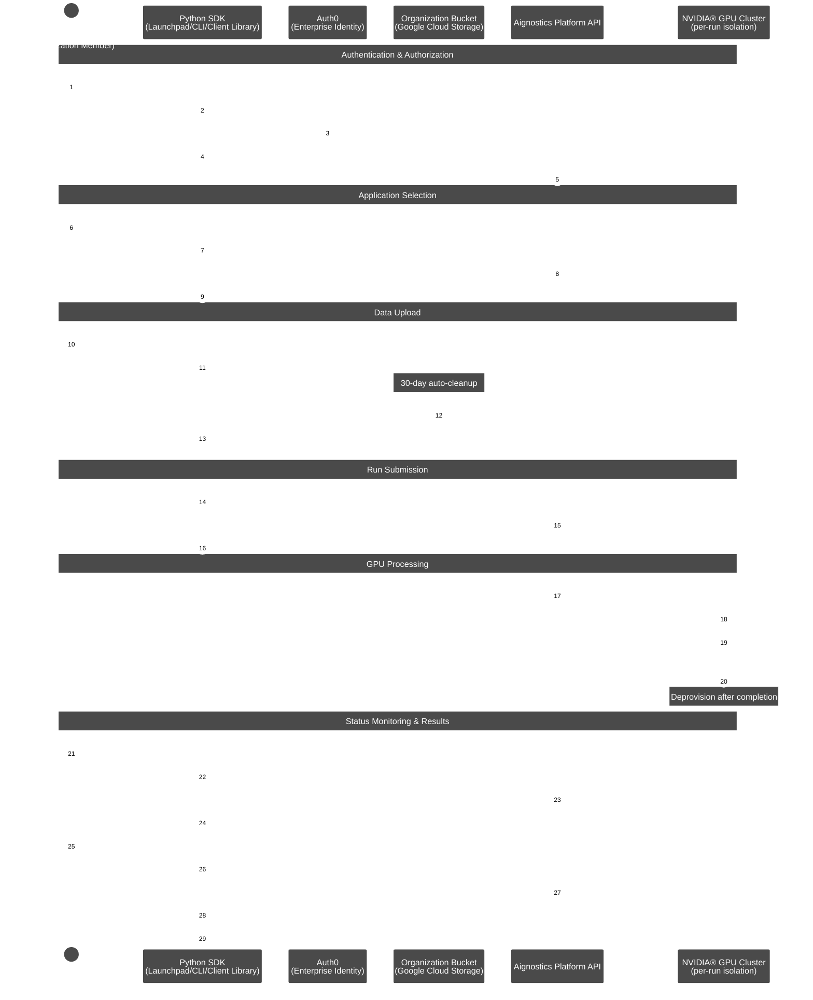

## Platform

### Overview

The **Aignostics Platform** is a comprehensive cloud-based service that allows organizations to leverage advanced computational pathology applications without the need for specialized expertise or complex infrastructure. Via its API it provides a standardized, secure interface for accessing Aignostics' portfolio of advanced computational pathology applications. These applications perform machine learning based tissue and cell analysis on histopathology slides, delivering quantitative measurements, visual representations, and detailed statistical data.

### Key Features
Aignostics Platform offers key features designed to maximize value for its users:

1. **Run Aignostics applications:** Run Aignostics advanced computational pathology applications like [Atlas H&E-TME](https://www.aignostics.com/products/he-tme-profiling-product) on your whole slide images (WSIs) and receive results in a easy to inspect formats.
2. **Multiple Access Points:** Interact with the platform via various pathways, from **Aignostics Launchpad** (desktop application for MacOS, Windows and Linux), **Aignostics CLI** (command-line interface for your terminal or shell scripts), **Example Notebooks** (we support Jupyter and Marimo), **Aignostics Client Library** (for integration with your Python codebase), or directly through the **API of the Aignostics Platform** (for integration with any programming language). Contact your business partner at Aignostics if you are interested to discuss a direct integration with your Imaging Management Systems (IMS) and Laboratory Information Management Systems (LIMS).
3. **Secure Data Handling:** Maintain control of your slide data through secure self-signed URLs. Results are automatically deleted after 30 days, and can be deleted earlier by the user.
4. **High-throughput processing with incremental results delivery:** Submit up to 500 whole slide images (WSI) in one batch request. Access results for individual slides as they completed processing, without having to wait for the entire batch to finish.
5. **Standard formats:** Support for commonly used image formats in digital pathology such as pyramidal DICOM, TIFF, and SVS. Results provided in standard formats like QuPath GeoJSON (polygons), TIFF (heatmaps) and CSV (measurements and statistics).

### Registration and User Access

To start using the Aignostics Platform and its advanced applications, your organization must be registered by our business support team:

1. Access to the Aignostics Platform requires a formal business agreement. Once an agreement is in place between your organization and Aignostics, we proceed with your organization's registration. If your organization does not yet have an account, please contact your account manager or email us at [support@aignostics.com](mailto:support@aignostics.com) to express your interest.
2. To register your organization, we require the name and email address of at least one employee, who will be assigned the Administrator role for your organisation. Your organisation's Administrator can invite and manage additional users. 

> [!Important]
> 1. All user accounts must be associated with your organization's official domain. We do not support the registration of private or personal email addresses.
> 2. For security, Two-Factor Authentication (2FA) is mandatory for all user accounts.
> 3. We can integrate with your IDP system (e.g. SAML, OIDC) for user authentication. Please contact us to discuss the integration.
> 4. Registering your organistation typically takes 2 business days depending on the complexity of the signed business agreement and specific requirements.

### Console

The web-based [*Aignostics Console*](https://platform.aignostics.com) is a user-friendly interface that allows you to 
manage your organization, applications, quotas, and users registered with the Aignostics Platform.

1. The Console is available to users registered for your organisation to manage their profile and monitor usage of their quota.
2. Administrators of your organization can invite additional users, manage the organisation and user specific quotas and monitor usage.
3. Both roles can trigger application runs.

### Applications
An application is a fully automated advanced machine learning based workflow composed of one or more specific tasks (e.g. Tissue Quality Control, Tissue Segmentation, Cell Detection, Cell Classification and predictive analysis). Each application is designed for a particular analysis purpose (e.g. Tumor Micro Environment analysis or biomarker scoring). For each application we define input requirements, processing tasks and output formats.

As contracted in your business agreement with Aignostics your organisation subscribes to one or more applications. The applications are available for your organization in the Aignostics Platform. You can find the list of available applications in the Console of the Aignostics Platform.

Each application can have multiple versions. Please make sure you read dedicated application documentation to understand its specific constraints regarding acceptable formats, staining method, tissue types and diseases.

Once registered to the Platform, your organization will automatically gain access to the "Test Application". This application can be used to configure the workflow and to make sure that the integration works correctly.

### Application run

To trigger the application run, users can use the Aignostics Launchpad, Aignostics CLI, Example Notebooks, our Client Library, or directly call the REST API. The platform expects the user payload, containing the metadata and the signed URLs to the whole slide images (WSIs). The detailed requirements of the payload depend on the application and are described in the documentation, and accessible via the Info button in the Launchpad, as well as via the CLI and `/v1/applications` endpoint in the API.

When the application run is created, it progresses through three states:

1. **pending**: the application run has been received and is waiting to start processing
2. **processing**: the application run is being executed; results for individual slides become available as they complete
3. **terminated**: the application run has finished

A terminated run carries a *termination reason* explaining the outcome:

- **all items processed**: every slide was processed (individual slides may still have failed — check the per-slide results)
- **canceled by the user**: the run was cancelled by the user before it finished
- **canceled by the system**: the run was stopped by the platform, for example when the number of failed slides exceeded the allowed threshold

The status and operations of an application run are private to the user who triggered the run.

### Results
When the processing of whole slide image is successfully completed, the resulting outputs become available for download. To assess specifics of application outputs please consult our application specific documentation, which you can find in the **Console**. Please note that you access to documentation is restricted to those applications your organisation subscribed to.

Application run outputs are automatically deleted 30 days after the application run has completed. However, the owner of the application run (the user who initiated it) can use the API to manually delete outputs earlier, once the run has terminated. The Launchpad and CLI provide enable to delete results with one click resp. command.

### Quotas
Every organization has a limit on how many WSIs it can process in a calendar month. The following quotas exist:

1. **Per organization**: as defined in your business agreement with Aignostics
2. **Per user**: defined by your organization Admin

When the per month quota is reached, an application run request is denied.

Other limitations may apply to your organization:

1. Allowed number of users an organization can register
2. Allowed number of images user can submit per application run
3. Allowed number of parallel application runs for the whole organization

Additionally, we allow organization Admin to define following limitations for its users:

1. Maximum number of images the user can process per calendar month.
2. Maximum number of parallel application runs for a given user

Visit the [Console](https://platform.aignostics.com) to check your current quota and usage. The Console provides a clear overview of the number of images processed by your organization and by each user, as well as the remaining quota for the current month.

### API

The **Aignostics Platform API** is a RESTful web service that allows you to interact with the platform programmatically. It provides endpoints for submitting whole slide images (WSIs) for analysis, checking the status of application runs, and retrieving results.

You can interact with the API using the Python client, which is a wrapper around the RESTful API. The Python client simplifies the process of making requests to the API and handling responses. It also provides convenient methods for uploading WSIs, checking application run status, and downloading results.

For integration with programming languages other than Python, you can use the RESTful API directly. The API is designed to be language-agnostic, meaning you can use any programming language that supports HTTP requests to interact with it. This includes languages like Java, Kotlin, C#, Ruby, and Typescript. 

### Cost

Every WSI processed by the Platform generates a cost. Usage of the "Test Application" is free of charge for any registered user. The cost for other applications is defined in your business agreement with Aignostics. The cost is calculated based on the number of slides processed. When an application run is cancelled, either by the system or by the user, only processed images incur a cost.

**[Read the API reference documentation](https://aignostics.readthedocs.io/en/latest/api_reference_v1.html)** or use our **[Interactive API Explorer](https://platform.aignostics.com/explore-api)** to dive into details of all operations and parameters.

### Platform workflow

The Aignostics Platform delivers enterprise-grade computational pathology through a secure, scalable cloud architecture. Organizations subscribe to the platform, and their users interact through three interfaces - all part of the Python SDK - to leverage advanced AI/ML models running on dedicated NVIDIA® GPU infrastructure.

**Key architectural components:**

- **Python SDK**: Provides three user interfaces (Launchpad desktop app, CLI, and Client Library) with unified functionality
- **Enterprise authentication**: Powered by Auth0, supporting Single Sign-On (SSO) and existing identity management systems
- **Organization storage**: Dedicated Google Cloud Storage bucket per organization with automatic 30-day cleanup
- **Aignostics Platform API**: Orchestrates application discovery, run submission, status monitoring, and results delivery
- **NVIDIA® GPU clusters**: Dedicated compute provisioned per application run for maximum security and compliance

**How it works:**

Organizations subscribe to the Aignostics Platform and receive dedicated infrastructure including a Google Cloud Storage bucket and API access. Users within the organization authenticate through Auth0, which integrates with enterprise identity management systems for seamless Single Sign-On (SSO).

The Python SDK - available as a desktop application (Launchpad), command-line interface (CLI), or programmable library (Client Library) - handles all complexity of authentication, data upload, run orchestration, and results delivery. Users simply select an application, provide whole slide images with metadata, and submit.

Behind the scenes, the Aignostics Platform API provisions dedicated NVIDIA® GPU clusters for each application run, ensuring data isolation and compliance with healthcare regulations. Processing occurs incrementally (slide-by-slide), allowing users to monitor progress and download results as they become available rather than waiting for entire cohorts.

The organization's Google Cloud Storage bucket stores uploaded files with automatic 30-day cleanup, optimizing costs while maintaining data availability throughout processing. All data transfers use time-limited signed URLs, eliminating credential management complexity and security risks.

**Enterprise benefits:**

- **Security & compliance**: Per-run GPU isolation, enterprise SSO integration, zero-trust architecture with signed URLs
- **Scalability**: Handles single exploratory slides through thousand-slide clinical studies with identical user experience
- **Cost efficiency**: Pay-per-use GPU provisioning, automatic storage cleanup, no idle infrastructure costs
- **Operational simplicity**: Python SDK abstracts all cloud complexity; IT teams manage access through existing identity systems
