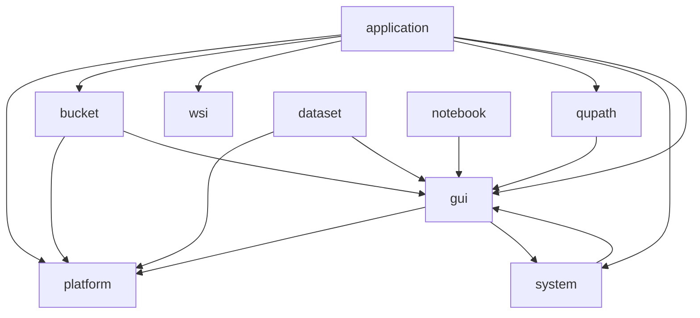

# CLAUDE.md - Aignostics SDK Modules Overview

> **v2 Architecture Note**: In v2, this `src/aignostics/` tree contains only the *heavy* modules:
> `application`, `wsi`, `dataset`, `bucket`, `qupath`, `notebook`, `gui`, and `system`.
> The `platform` and `utils` modules (plus `constants`) have moved to the slim package at
> `packages/aignostics-sdk/` under the `aignostics_sdk` namespace.
> The full `aignostics` package depends on `aignostics-sdk` and re-exports nothing from those
> moved modules — callers must update their imports (see `migration.md` in the docs).

This file provides a comprehensive overview of all modules in the Aignostics SDK, their core features, user interfaces, and interactions.

## Module Index

| Module | Core Purpose | CLI | GUI | Service |
|--------|-------------|-----|-----|---------|
| **platform** | Authentication & API client | ✅ | ❌ | ✅ |
| **application** | Application run orchestration | ✅ | ✅ | ✅ |
| **wsi** | Whole slide image processing | ✅ | ✅ | ✅ |
| **dataset** | IDC dataset downloads | ✅ | ✅ | ✅ |
| **bucket** | Cloud storage operations | ✅ | ✅ | ✅ |
| **utils** | Core utilities & DI | ✅ | ❌ | ✅ |
| **gui** | Desktop launchpad | ❌ | ✅ | ✅ |
| **notebook** | Marimo notebook server | ❌ | ✅ | ✅ |
| **qupath** | QuPath integration | ✅ | ✅ | ✅ |
| **system** | System information | ✅ | ✅ | ✅ |

Helper packages without their own CLAUDE.md: `dicom/`, `idc/`, `marimo/`,
`thumbnail/`, `tiff/` — internal support used by the modules above (DICOM
handling, IDC access, Marimo notebook assets, thumbnailing, TIFF I/O).

## Module Descriptions

### 🔐 platform

**Foundation module providing authentication, API access, and SDK metadata tracking**

- **Core Features**:
  - OAuth 2.0 authentication, JWT token management, API client wrapper
  - **SDK Metadata System**: Automatic tracking of execution context, user info, CI/CD environment
  - JSON Schema validation for metadata; schema versions live in
    `platform/_sdk_metadata.py` (`SDK_METADATA_SCHEMA_VERSION` /
    `ITEM_SDK_METADATA_SCHEMA_VERSION`) — not hardcoded here
  - Operation caching for non-mutating API calls
- **CLI**:
  - `user login`, `user logout`, `user whoami` for authentication
  - `sdk run-metadata-schema`, `sdk item-metadata-schema` for JSON Schema export
- **Dependencies**: `utils` (logging, user_agent generation)
- **Used By**: All modules requiring API access; application module for automatic metadata attachment

### 🚀 application

**High-level orchestration for ML model execution**

- **Core Features**: Application run lifecycle, version management, progress tracking, result downloads
- **CLI**: Full CRUD for application runs (`list`, `submit`, `describe`, `download`)
- **GUI**: Rich interface for run submission and monitoring with real-time progress
- **Dependencies**: `platform` (API), `bucket` (storage), `wsi` (validation), `utils` (DI)
- **Optional**: `qupath` for WSI visualization (requires `ijson`)

### 🔬 wsi

**Medical image file handling and processing**

- **Core Features**: Format detection, thumbnail generation, metadata extraction
- **CLI**: `inspect`; `dicom inspect`, `dicom geojson_import` (see `wsi/_cli.py`)
- **GUI**: Image viewer and metadata display
- **Handlers**: OpenSlide (.svs, .tiff), PyDICOM (DICOM files)
- **Dependencies**: `utils` (logging)

### 📦 dataset

**High-performance dataset downloads from IDC**

- **Core Features**: IDC integration, s5cmd parallel downloads, progress tracking
- **CLI**: Dataset search and download commands
- **GUI**: Dataset browser and download manager
- **Dependencies**: `platform` (auth), `utils` (process management)
- **External**: `s5cmd` binary for transfers

### ☁️ bucket

**Cloud storage abstraction layer**

- **Core Features**: S3/GCS operations, signed URLs, chunked transfers
- **CLI**: Upload/download commands
- **GUI**: Storage browser interface
- **Dependencies**: `platform` (credentials), `utils` (settings)
- **External**: `boto3` for AWS S3

### 🛠️ utils

**Core infrastructure and shared utilities**

- **Core Features**:
  - Dependency injection, logging, settings, health checks
  - Enhanced user agent with CI/CD context tracking
  - **MCP Server**: Central MCP server with auto-discovery of plugin tools (`mcp_create_server`, `mcp_run`, `mcp_list_tools`)
  - **Navigation**: GUI sidebar navigation infrastructure (`BaseNavBuilder`, `NavItem`, `NavGroup`)
- **Service Discovery**: `locate_implementations()`, `locate_subclasses()`
- **User Agent**: Generates `{name}-python-sdk/{version} ({platform}; +{repo_url}; {test}; {github_run_url})`
- **Used By**: All modules; platform module for SDK metadata

### 🖥️ gui

**Desktop application launchpad**

- **Core Features**: Module launcher, unified interface
- **GUI Only**: NiceGUI-based desktop interface (nicegui is a core dependency;
  there is no `[gui]` extra)
- **Dependencies**: All modules with GUI components
- **Launch**: `aignostics launchpad`

### 📓 notebook

**Interactive Marimo notebook environment**

- **Core Features**: Reactive notebook server, data exploration, analysis workflows
- **GUI Only**: Embedded Marimo interface (no CLI)
- **Process Management**: Subprocess lifecycle with health monitoring
- **Dependencies**: `utils` (base service), `marimo` package
- **Requirements**: `pip install marimo`

### 🔍 qupath

**Bioimage analysis integration (optional)**

- **Core Features**: QuPath project management, WSI annotation
- **CLI**: Project creation and annotation commands
- **Requirements**: `ijson` package (`pip install aignostics[qupath]`)
- **Dependencies**: `utils` (base service)

### 💻 system

**System information and diagnostics**

- **Core Features**: Environment info, dependency checks
- **CLI**: `info` command for system diagnostics
- **Dependencies**: `utils` (logging)

## Module Interaction Patterns

### Architecture: Service Layer with Dual Presentation Layers

```text
┌─────────────────────────────────────────────────────────────┐
│                     GUI Launchpad (gui/)                   │
│                  (Desktop Interface Aggregator)            │
└─────────────────────────────────────────────────────────────┘
                                ↓
┌─────────────────────────────────────────────────────────────┐
│                    Per-Module Architecture                  │
├─────────────────────────────────────────────────────────────┤
│  ┌─────────────────┐        ┌─────────────────┐           │
│  │   CLI (_cli.py) │        │  GUI (_gui.py)  │           │
│  │  Text Interface │        │   NiceGUI UI    │           │
│  └────────┬────────┘        └────────┬────────┘           │
│           │                           │                     │
│           └──────────┬────────────────┘                    │
│                      ↓                                      │
│         ┌──────────────────────────┐                       │
│         │   Service (_service.py)   │                      │
│         │    Business Logic Core    │                      │
│         └──────────────────────────┘                       │
└─────────────────────────────────────────────────────────────┘

This pattern repeats for: platform, application, wsi, dataset,
bucket, qupath, system (each module has CLI + Service, most have GUI)
```

The service dependency graph is captured textually under "Module
Communication → Direct Dependencies" below.

### Common Integration Patterns

**1. Application Run Workflow:**

```python
platform → authenticate
application → create run
bucket → upload WSI files
application → monitor progress
bucket → download results
qupath → visualize (optional)
```

**2. Dataset Processing:**

```python
platform → authenticate
dataset → download from IDC
wsi → validate files
application → batch process
```

**3. Service Discovery:**

```python
utils.locate_implementations(BaseService)
→ Finds all service implementations
→ Used by GUI to discover modules
```

## Module Communication

### Direct Dependencies

Verified from cross-module imports. `utils` and `constants` are foundation
(imported almost everywhere) and omitted from the graph for clarity. `dicom`,
`idc`, `thumbnail`, `tiff` are leaf modules that import only `utils`.



`gui` and `system` are mutually coupled: `system` registers GUI pages through
`gui`, and the `gui` frame calls `SystemService.health_static()`.

### Shared Resources

- **Authentication**: Token cached by `platform`, used by all API calls
- **Settings**: Managed by `utils`, consumed by all modules
- **Logging**: Centralized through `loguru.logger`
- **Health Checks**: All services implement `BaseService.health()`

## CLI Usage Examples

```bash
# Authenticate
aignostics user login

# List applications
aignostics application list

# Submit a run (positional: application_id, metadata CSV file)
aignostics application run submit heta metadata.csv

# Download an IDC dataset (positional: source, target)
aignostics dataset idc download <source> <target>

# Get WSI info
aignostics wsi inspect slide.svs

# Launch the desktop interface
aignostics launchpad
```

## Module-Specific Documentation

For detailed information about each module, see:

- [platform/CLAUDE.md](platform/CLAUDE.md) - Authentication, API client, and SDK metadata system
- [application/CLAUDE.md](application/CLAUDE.md) - Application orchestration
- [wsi/CLAUDE.md](wsi/CLAUDE.md) - Image processing
- [dataset/CLAUDE.md](dataset/CLAUDE.md) - Dataset operations
- [bucket/CLAUDE.md](bucket/CLAUDE.md) - Storage management
- [utils/CLAUDE.md](utils/CLAUDE.md) - Infrastructure details
- [gui/CLAUDE.md](gui/CLAUDE.md) - Desktop interface
- [notebook/CLAUDE.md](notebook/CLAUDE.md) - Marimo notebook integration
- [qupath/CLAUDE.md](qupath/CLAUDE.md) - QuPath integration
- [system/CLAUDE.md](system/CLAUDE.md) - System diagnostics

## Development Guidelines

New module checklist: inherit from `utils.BaseService` (for service discovery),
implement `health()` and `info()`, add a Typer `_cli.py`, add `_gui.py` (NiceGUI)
if it has a UI, create a `CLAUDE.md`, and update this index. Copy an existing
module (e.g. `system/`) as the pattern rather than scaffolding from scratch.

---

*This index provides a high-level map of the Aignostics SDK architecture. Each module's CLAUDE.md contains implementation details and usage examples.*
