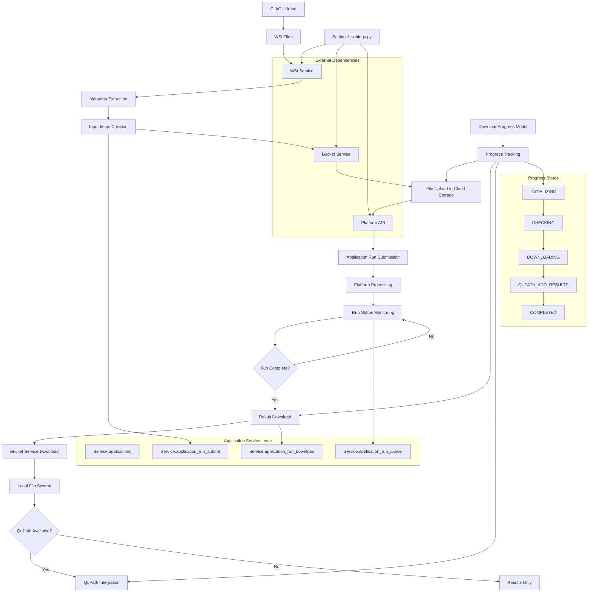

## 1. Description

### 1.1 Purpose

The Application Module provides comprehensive management of AI applications and their execution lifecycle on the Aignostics Platform. It enables users to discover, submit, monitor, and retrieve results from computational pathology applications through a unified interface.

The module implements a domain service layer that orchestrates interactions between the platform API, local file systems, and multiple specialized services (WSI, bucket, QuPath) to provide a unified interface for AI application workflows. It abstracts the complexity of the underlying platform through a multi-modal approach, offering CLI, GUI, and programmatic interfaces that coordinate the complete lifecycle from data preparation through result analysis.

### 1.2 Functional Requirements

The Application Module shall:

- **FR-01** **Application Discovery**: List and browse available applications with filtering capabilities and detailed information retrieval, including listing, describing, and downloading public release documents (e.g. output schemas, model manuals) attached to application versions
- **FR-02** **Data Preparation**: Automatically scan directories for whole slide images (WSI), extract comprehensive metadata, and validate file formats
- **FR-03** **File Upload Management**: Provide secure, chunked file upload to cloud storage with progress tracking and integrity verification
- **FR-04** **Run Lifecycle Management**: Submit, monitor, cancel, and delete application runs with real-time status updates
- **FR-05** **Result Download**: Progressive download of analysis results with resumable operations and organized directory hierarchies
- **FR-06** **QuPath Integration**: Automatic QuPath project creation with downloaded results for pathology analysis
- **FR-07** **Multi-Modal Interface**: Provide CLI, GUI, and programmatic interfaces for different user workflows

### 1.3 Non-Functional Requirements

- **Performance**: Handle multi-gigabyte whole slide images with memory-efficient streaming processing through bucket and WSI service integration
- **Security**: Implement data integrity verification, secure token-based authentication, and comprehensive input validation
- **Reliability**: Provide graceful error handling with typed exceptions, resumable operations after interruption, and partial failure handling for batch operations
- **Usability**: Offer real-time progress tracking, user-friendly error messages, and consistent interfaces across CLI/GUI/API
- **Scalability**: Support large-scale operations through integration with cloud storage and platform services

### 1.4 Constraints and Limitations

- Platform API compatibility requirements with auto-generated client integration
- File format support limited to major medical imaging formats (DICOM, TIFF, SVS)
- Memory management constraints for large file processing with configurable chunk sizes
- Optional QuPath integration requiring ijson dependency for full functionality

---

## 2. Architecture and Design

### 2.1 Module Structure

```
application/
├── _service.py          # Core business logic and application lifecycle management
├── _cli.py             # Command-line interface for application operations
├── _gui/               # Web-based GUI components
│   ├── _frame.py        # Main GUI application frame
│   ├── _page_index.py   # Application discovery and selection page
│   ├── _page_application_describe.py # Application details and description page
│   ├── _page_application_run_describe.py # Run details and management page
│   ├── _page_builder.py # Dynamic page builder utilities
│   ├── _utils.py        # GUI utility functions
│   └── assets/          # Static assets (images, animations, icons)
├── _settings.py        # Module-specific configuration and environment variables
├── _utils.py          # Helper functions for metadata processing and validation
└── __init__.py        # Module exports and public API
```

### 2.2 Key Components

| Component               | Type  | Purpose                                                        | Public API                                                                                                                                                                           |
| ----------------------- | ----- | -------------------------------------------------------------- | ------------------------------------------------------------------------------------------------------------------------------------------------------------------------------------ |
| `DownloadProgressState` | Enum  | Enumeration of download progress states                        | `INITIALIZING`, `QUPATH_ADD_INPUT`, `CHECKING`, `WAITING`, `DOWNLOADING`, `QUPATH_ADD_RESULTS`, `QUPATH_ANNOTATE_INPUT_WITH_RESULTS`, `COMPLETED`                                    |
| `DownloadProgress`      | Model | Progress tracking for download operations with computed fields | `total_artifact_count`, `total_artifact_index`, `item_progress_normalized`, `artifact_progress_normalized`                                                                           |
| `Service`               | Class | Main service class for application lifecycle management        | `applications()`, `application_run_submit()`, `application_run_download()`, `application_runs()`, `application_run()`, `application_run_cancel()`, `application_run_result_delete()` |

### 2.3 Design Patterns

- **Service Layer Pattern**: Core business logic encapsulated in ApplicationService with consistent interfaces
- **Dependency Injection**: Dynamic discovery and lazy initialization of platform clients and dependent services
- **Observer Pattern**: Progress tracking through queue-based communication and callback mechanisms
- **Strategy Pattern**: Multi-modal interface design with CLI, GUI, and programmatic access patterns

---

## 3. Inputs and Outputs

### 3.1 Inputs

| Input Type                 | Source        | Data Type/Format | Validation Rules                                       | Business Rules                                  |
| -------------------------- | ------------- | ---------------- | ------------------------------------------------------ | ----------------------------------------------- |
| **Supported WSI Files**    | CLI/GUI       | Path object      | Must exist, extension in WSI_SUPPORTED_FILE_EXTENSIONS | File must be readable, format must be supported |
| **Application Version ID** | API           | String           | Must be valid UUID format                              | Must correspond to existing application version |
| **Input Items**            | API           | List[InputItem]  | Each item must have valid metadata                     | Items must match application input schema       |
| **Run ID**                 | API           | String           | Must be valid UUID format                              | Must correspond to existing application run     |
| **Upload Chunks**          | Configuration | Integer          | Must be positive value                                 | Configurable based on platform limits           |

### 3.2 Outputs

| Output Type            | Destination      | Data Type/Format      | Success Criteria                                   | Error Conditions                        |
| ---------------------- | ---------------- | --------------------- | -------------------------------------------------- | --------------------------------------- |
| **Application Runs**   | Platform API     | ApplicationRun object | Run successfully submitted with valid ID           | Platform API failure, validation errors |
| **Downloaded Results** | Local filesystem | Directory structure   | All artifacts downloaded to organized directories  | Network failure, permission errors      |
| **QuPath Projects**    | Local filesystem | .qpproj file          | Valid QuPath project with input/result integration | QuPath dependency missing, file errors  |
| **Progress Updates**   | Callback/GUI     | DownloadProgress      | Real-time progress tracking with normalized values | Callback execution errors               |
| **Metadata Reports**   | CLI/GUI          | Formatted text/JSON   | Human-readable metadata display                    | Processing errors, missing files        |

### 3.3 Data Schemas

**InputItem Schema:**

```yaml
InputItem:
  type: object
  properties:
    path:
      type: string
      description: File system path to WSI file
    metadata:
      type: object
      description: Extracted WSI metadata including dimensions and format
    bucket_key:
      type: string
      description: Cloud storage key after upload
  required: [path, metadata]
```

**DownloadProgress Schema:**

```yaml
DownloadProgress:
  type: object
  properties:
    state:
      type: string
      enum: [INITIALIZING, CHECKING, DOWNLOADING, QUPATH_ADD_RESULTS, COMPLETED]
    total_artifact_count:
      type: integer
      description: Total number of artifacts to download
    total_artifact_index:
      type: integer
      description: Current artifact being processed
    item_progress_normalized:
      type: number
      minimum: 0
      maximum: 1
      description: Progress for current item (0-1)
    artifact_progress_normalized:
      type: number
      minimum: 0
      maximum: 1
      description: Overall progress across all artifacts (0-1)
  required: [state, total_artifact_count, total_artifact_index]
```

### 3.4 Data Flow



---

## 4. Interface Definitions

### 4.1 Public API

#### Core Service Interface

```python
class Service:
    """Service of the application module."""

    def applications(self) -> list[Application]:
        """List all available applications with filtering capabilities

        Returns:
            List of Application objects with metadata

        Raises:
            Exception: When application list cannot be retrieved
        """
        pass

    def application_run_submit(
        self,
        application_id: str,
        items: list[InputItem],
        application_version: str | None = None,
        custom_metadata: dict[str, Any] | None = None,
        note: str | None = None,
        tags: set[str] | None = None,
        due_date: str | None = None,
        deadline: str | None = None,
        onboard_to_aignostics_portal: bool = False,
        gpu_type: str | None = None,
        gpu_provisioning_mode: str | None = None,
        max_gpus_per_slide: int | None = None,
        flex_start_max_run_duration_minutes: int | None = None,
        cpu_provisioning_mode: str | None = None,
        node_acquisition_timeout_minutes: int | None = None,
    ) -> Run:
        """Submit application run with validated inputs

        Args:
            application_id: ID of the application to run
            items: List of items to process with metadata
            application_version: Optional application version (defaults to latest)
            custom_metadata: Optional custom metadata to attach to the run
            note: Optional human-readable note
            tags: Optional set of tags for filtering
            due_date: Optional ISO 8601 datetime string for requested completion
                      (e.g. '2025-10-19T19:53:00+00:00'). Must be timezone-aware,
                      in the future, and before `deadline` when both are provided.
            deadline: Optional ISO 8601 datetime string for the hard run deadline.
                      Must be timezone-aware, in the future, and after `due_date`
                      when both are provided.
            onboard_to_aignostics_portal: Whether to onboard the run to the portal
            gpu_type: Optional GPU type for the run
            gpu_provisioning_mode: Optional GPU provisioning mode
            max_gpus_per_slide: Optional maximum GPUs per slide
            flex_start_max_run_duration_minutes: Optional max run duration in minutes
            cpu_provisioning_mode: Optional CPU provisioning mode
            node_acquisition_timeout_minutes: Optional node acquisition timeout

        Returns:
            Run object with run details

        Raises:
            ValueError: When input validation fails (including scheduling date validation)
            RuntimeError: When submission fails
        """
        pass

    def application_run_submit_from_metadata(
        self,
        application_id: str,
        metadata: list[dict[str, Any]],
        application_version: str | None = None,
        custom_metadata: dict[str, Any] | None = None,
        note: str | None = None,
        tags: set[str] | None = None,
        due_date: str | None = None,
        deadline: str | None = None,
        onboard_to_aignostics_portal: bool = False,
        gpu_type: str | None = None,
        gpu_provisioning_mode: str | None = None,
        max_gpus_per_slide: int | None = None,
        flex_start_max_run_duration_minutes: int | None = None,
        cpu_provisioning_mode: str | None = None,
        node_acquisition_timeout_minutes: int | None = None,
    ) -> Run:
        """Submit application run from prepared metadata dicts

        Delegates to `application_run_submit` after converting metadata dicts
        to InputItem objects. Accepts the same scheduling parameters.

        Args:
            application_id: ID of the application to run
            metadata: List of metadata dicts (as produced by `run prepare`)
            application_version: Optional application version (defaults to latest)
            custom_metadata: Optional custom metadata to attach to the run
            note: Optional human-readable note
            tags: Optional set of tags for filtering
            due_date: Optional ISO 8601 datetime string for requested completion
            deadline: Optional ISO 8601 datetime string for the hard run deadline
            onboard_to_aignostics_portal: Whether to onboard the run to the portal
            gpu_type: Optional GPU type for the run
            gpu_provisioning_mode: Optional GPU provisioning mode
            max_gpus_per_slide: Optional maximum GPUs per slide
            flex_start_max_run_duration_minutes: Optional max run duration in minutes
            cpu_provisioning_mode: Optional CPU provisioning mode
            node_acquisition_timeout_minutes: Optional node acquisition timeout

        Returns:
            Run object with run details

        Raises:
            ValueError: When input validation fails (including scheduling date validation)
            RuntimeError: When submission fails
        """
        pass

    def application_run_download(
        self, run_id: str, output_dir: Path, progress_callback: Optional[Callable] = None
    ) -> DownloadProgress:
        """Download results with progress tracking

        Args:
            run_id: Application run identifier
            output_dir: Directory for downloaded results
            progress_callback: Optional callback for progress updates

        Returns:
            DownloadProgress object with completion status

        Raises:
            NotFoundException: When run ID is invalid
            RuntimeError: When download operation fails
        """
        pass

    def application_runs(
        self,
        application_id: str | None = None,
        application_version: str | None = None,
        external_id: str | None = None,
        has_output: bool = False,
        note_regex: str | None = None,
        note_query_case_insensitive: bool = True,
        tags: set[str] | None = None,
        query: str | None = None,
        limit: int | None = None,
        for_organization: str | None = None,
    ) -> list[RunData]:
        """List application runs, optionally scoped to an organization.

        Args:
            application_id: Filter by application ID.
            application_version: Filter by application version.
            external_id: Filter by external ID.
            has_output: If True, only runs with partial or full output are retrieved.
            note_regex: Optional regex to filter runs by note metadata.
            note_query_case_insensitive: If True, note regex matching is case-insensitive.
            tags: Optional set of tags to filter runs.
            query: Optional free-text query.
            limit: Optional maximum number of results to return.
            for_organization: Return all runs by users of the specified organization
                              (org admins only). None = current user's runs only.

        Raises:
            ForbiddenException: When the caller is not an admin of the requested org.
        """
        pass

    def application_run_update_custom_metadata(
        self,
        run_id: str,
        custom_metadata: dict[str, Any],
        *,
        custom_metadata_checksum: str | None = None,
        enrich_sdk_metadata: bool = True,
    ) -> None:
        """Update the custom metadata of an existing run.

        Args:
            run_id: Application run identifier.
            custom_metadata: New custom metadata to attach to the run.
            custom_metadata_checksum: Optional checksum for optimistic concurrency
                control. When provided, a stale write is rejected by the platform
                with HTTP 412 and surfaced as ConcurrencyConflictError. None skips
                the precondition check.
            enrich_sdk_metadata: When True (default), auto-generated SDK tracking
                context is merged into the `sdk` field and schema-validated. When
                False, custom_metadata is forwarded verbatim (sdk field neither
                merged nor validated).

        Raises:
            NotFoundException: When the run ID is not found.
            ConcurrencyConflictError: When the checksum precondition fails (HTTP 412).
            ValueError: When the run ID or metadata is invalid.
            RuntimeError: When the update fails unexpectedly.
        """
        pass

    def application_run_update_item_custom_metadata(
        self,
        run_id: str,
        external_id: str,
        custom_metadata: dict[str, Any],
        *,
        custom_metadata_checksum: str | None = None,
        enrich_sdk_metadata: bool = True,
    ) -> None:
        """Update the custom metadata of an item within a run.

        Same `custom_metadata_checksum` and `enrich_sdk_metadata` semantics as
        `application_run_update_custom_metadata`, scoped to the item identified by
        `external_id`.

        Raises:
            NotFoundException: When the run or item is not found.
            ConcurrencyConflictError: When the checksum precondition fails (HTTP 412).
            ValueError: When the run ID or item external ID is invalid.
            RuntimeError: When the update fails unexpectedly.
        """
        pass
```

### 4.2 CLI Interface

**Command Structure:**

```bash
uvx aignostics application [subcommand] [options]
```

**Available Commands:**

- `list`: List all available applications with filtering
- `describe`: Get detailed information about a specific application
- `dump-schemata`: Export application schemata
- `version document list`: List public release documents attached to an application version
- `version document describe`: Show metadata for a single public release document
- `version document download`: Download a public release document to a local path
- `run execute`: Combined prepare, upload, and submit workflow
- `run prepare`: Generate metadata from source directory
- `run upload`: Upload files to cloud storage
- `run submit`: Submit application run
- `run list`: List application runs
- `run describe`: Get detailed run information
- `run cancel`: Cancel running application
- `run result download`: Download run results
- `run result delete`: Delete run results
- `run dump-metadata` / `run dump-item-metadata`: Dump a run's/item's custom metadata as JSON;
  `--show-checksum` additionally emits the current `custom_metadata_checksum`
- `run update-metadata` / `run update-item-metadata`: Replace a run's/item's custom metadata.
  `--checksum` guards the write with optimistic concurrency control (exit code 3 on conflict);
  `--enrich-sdk-metadata / --no-enrich-sdk-metadata` (default enrich) controls whether the SDK
  merges auto-generated tracking context into the `sdk` field or forwards it verbatim

### 4.3 GUI Interface

- **Navigation**: Accessible through main application menu and dashboard
- **Key UI Components**:
  - Application discovery and selection interface
  - Interactive submission workflow with file management
  - Real-time progress tracking with visual indicators
  - Results management with download capabilities
  - Optional QuPath integration when available
- **User Workflows**:
  - Browse → Select → Upload → Submit → Monitor → Download → Analyze

---

## 5. Dependencies and Integration

### 5.1 Internal Dependencies

| Dependency Module | Usage Purpose                           | Interface Used                              |
| ----------------- | --------------------------------------- | ------------------------------------------- |
| Platform Service  | Core platform API communication         | Client initialization, authentication       |
| Bucket Service    | Cloud storage operations                | File upload/download, signed URL generation |
| WSI Service       | Medical image processing and metadata   | Format detection, metadata extraction       |
| Utils Module      | Settings, logging, dependency injection | Configuration management, service discovery |

### 5.2 External Dependencies

| Dependency    | Version  | Purpose                        | Optional/Required |
| ------------- | -------- | ------------------------------ | ----------------- |
| aignx-codegen | Latest   | Platform API client generation | Required          |
| ijson         | >=3.4.0  | QuPath integration             | Optional          |
| crc32c        | >=2.7.0  | Data integrity verification    | Required          |
| humanize      | >=4.12.3 | Progress formatting            | Required          |
| tqdm          | >=4.67.1 | CLI progress indicators        | Required          |

### 5.3 Integration Points

- **Aignostics Platform API**: RESTful API integration for application management, run submission, and result retrieval
- **Cloud Storage Services**: Google Cloud Storage and AWS S3 integration through bucket service
- **QuPath Application**: Optional integration for pathology analysis and annotation management

---

## 6. Configuration and Settings

### 6.1 Configuration Parameters

Configuration is managed through environment variables with the prefix `AIGNOSTICS_APPLICATION_`. The module uses Pydantic settings for validation and secure credential handling.

| Parameter Pattern              | Type | Description                        | Required |
| ------------------------------ | ---- | ---------------------------------- | -------- |
| `AIGNOSTICS_APPLICATION_*`     | var  | Application-specific configuration | No       |
| Platform-specific chunk sizes  | int  | Configurable through platform API  | No       |
| Upload/download configurations | var  | Managed by bucket and WSI services | No       |

### 6.2 Environment Variables

| Variable                   | Purpose                            | Example Value                     |
| -------------------------- | ---------------------------------- | --------------------------------- |
| `AIGNOSTICS_APPLICATION_*` | Application-specific configuration | Various configuration parameters  |
| `AIGNOSTICS_PLATFORM_URL`  | Platform API endpoint              | `https://platform.aignostics.com` |
| `AIGNOSTICS_AUTH_TOKEN`    | Authentication token               | `eyJhbGciOiJSUzI1NiIs...`         |

---

## 7. Error Handling and Validation

### 7.1 Error Categories

| Error Type            | Cause                            | Handling Strategy                                   | User Impact                                |
| --------------------- | -------------------------------- | --------------------------------------------------- | ------------------------------------------ |
| `ValueError`          | Invalid input data or metadata   | Input validation with feedback                      | Clear validation error messages            |
| `RuntimeError`        | Platform API or operation errors | Retry with exponential backoff                      | Error details and guidance                 |
| `NotFoundException`   | Missing runs or applications     | Graceful rejection with info                        | Clear resource not found info              |
| `FileNotFoundError`   | Missing input files              | File validation before upload                       | File path verification help                |
| `ApiException`        | Platform API failures            | Retry mechanism with recovery                       | API error details and guidance             |
| `ForbiddenException`  | Caller not authorized for the requested org | Caught in CLI; exit 2 with access-denied message | User informed they lack permission    |
| `ConcurrencyConflictError` | Custom-metadata update rejected (HTTP 412): metadata modified since the checksum was read | `ValueError` subclass; caught in CLI, exit 3 | User told to re-read and retry the update |

### 7.2 Input Validation

- **WSI Files**: Format validation, file existence, size limits, and metadata extraction verification
- **Application Metadata**: Schema validation against application-specific requirements with type checking
- **Directory Paths**: Path existence, read permissions, and recursive access validation
- **Scheduling Dates**: ISO 8601 format validation, timezone-awareness check (naive datetimes rejected), future-date assertion (both dates must be after UTC now), and cross-field constraint (`due_date` must be strictly before `deadline` when both are provided)

### 7.3 Graceful Degradation

- **When QuPath dependencies are unavailable**: QuPath integration features are disabled with informative messages
- **When platform API is unreachable**: Local operations continue with cached data where possible
- **When individual file uploads fail**: Batch operations continue with error reporting for failed items

---

## 8. Security Considerations

### 8.1 Data Protection

- **Authentication**: Token-based authentication with automatic session management and secure credential storage
- **Data Encryption**: HTTPS for all API communications and encrypted storage for sensitive configuration
- **Access Control**: Platform-based authorization with organization-level permissions and role-based access

### 8.2 Security Measures

- **Input Sanitization**: Comprehensive validation of all user inputs including file paths and metadata
- **Secret Management**: Secure handling of authentication tokens and API keys with automatic masking in logs
- **Audit Logging**: Security events logged including authentication, authorization, and data access operations

---

## 9. Implementation Details

### 9.1 Key Algorithms and Business Logic

- **Metadata Generation Pipeline**: Multi-stage pipeline for WSI file discovery, metadata extraction, and validation
- **Progress Tracking Algorithm**: Normalized progress calculation with multi-level aggregation across files and operations
- **Chunked Upload Algorithm**: Memory-efficient streaming upload with integrity verification and resume capability

### 9.2 State Management and Data Flow

- **Configuration State**: Environment-aware settings management with Pydantic validation and secure credential handling
- **Runtime State**: Progress tracking state persistence for resumable operations and error recovery
- **Cache Management**: Platform client caching with lazy initialization and automatic session management

### 9.3 Performance and Scalability Considerations

- **Async Operations**: Asynchronous file upload/download operations with configurable concurrency limits
- **Thread Safety**: Thread-safe progress tracking and state management with queue-based communication
- **Resource Management**: Proper cleanup of network connections and file handles with context managers
- **Memory Efficiency**: Handle multi-gigabyte files through streaming and chunked operations
- **Scalability Patterns**: Integration with cloud storage services for horizontal scaling
