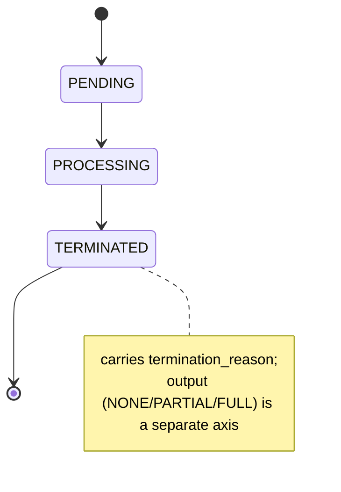

# CLAUDE.md - Platform Module

This file provides comprehensive guidance to Claude Code and human engineers when working with the `platform` module in this repository.

## Module Overview

The platform module serves as the foundational API client interface for the Aignostics Platform, providing secure, scalable, and enterprise-ready access to computational pathology services.

### Core Responsibilities

**Authentication & API Access:**

- **OAuth 2.0 Authentication**: Device flow, JWT validation, token lifecycle management with 5-minute refresh buffer
- **Environment Management**: Multi-environment support (dev/staging/production) with automatic endpoint detection
- **Resource Abstraction**: Type-safe wrappers for applications, versions, runs with memory-efficient pagination

**Performance & Reliability:**

- **Operation Caching**: Token-aware caching for read operations with configurable TTLs
- **Retry Logic**: Exponential backoff with jitter for transient failures
- **Timeout Management**: Per-operation timeouts, configurable via env vars
- **Cache Invalidation**: Automatic global cache clearing on mutations for consistency

**Observability & Tracking:**

- **SDK Metadata System**: Automatic tracking of execution context, user, CI/CD environment for all runs and items
- **JSON Schema Validation**: Pydantic-based validation with versioned schemas
  (see `SDK_METADATA_SCHEMA_VERSION` / `ITEM_SDK_METADATA_SCHEMA_VERSION` in `_sdk_metadata.py`)
- **Enhanced User Agent**: Context-aware user agent with pytest and GitHub Actions integration

**State & statistics:**

- **State enums**: `RunState`, `ItemState` (`PENDING`/`PROCESSING`/`TERMINATED`) plus per-run/item/artifact
  *output* enums (`RunOutput`, `ItemOutput`, `ArtifactOutput`) — see State Models section below
- **Statistics Tracking**: Aggregate `RunItemStatistics` for progress monitoring

### User Interfaces

**CLI Commands (`_cli.py`):**

User authentication commands:

- `user login` - Authenticate with Aignostics Platform (device flow or browser)
- `user logout` - Remove cached authentication token
- `user whoami` - Display current user information and organization details

SDK metadata commands (`--pretty` / `--no-pretty`):

- `sdk run-metadata-schema` - Print the JSON Schema for Run SDK metadata
- `sdk item-metadata-schema` - Print the JSON Schema for Item SDK metadata

**Service Layer (`_service.py`):**

The service provides authentication management used by both CLI and other modules:

- Token caching and refresh
- User information retrieval
- Login/logout operations

## Architecture & Design Patterns

### Layered Architecture

`Client` (public API) → resource accessors (`Applications`, `Versions`, `Runs`, `ShareTokens`)
→ authenticated wrapper (`_AuthenticatedApi`) → generated `aignx.codegen` client → urllib3.

### Resource Pattern

Each resource follows consistent REST conventions:

- `list()` - Returns generator for memory-efficient pagination
- `get(id)` - Retrieves single resource
- Methods follow REST conventions

## Critical Implementation Details

### Client Implementation (`_client.py`)

`Client` exposes four resource accessors: `applications`, `versions`, `share_tokens`, `runs`.
Public methods (all cached + retried where noted — see below):

- `me(nocache=False)` → `Me` — current user/org.
- `application(application_id, nocache=False)` → `Application` — direct endpoint
  `read_application_by_id_v1_applications_application_id_get` (NOT a list iteration).
- `application_version(application_id, version_number=None, nocache=False)` → `ApplicationVersion`
  (`VersionReadResponse`). `None` resolves the latest via `Versions.latest()`; validates semver.
- `run(run_id)` → `Run` handle (not cached; just wraps the id).

API client instances are shared across `Client` instances via three class-level pools
(cached-token / uncached-token / external-provider); see `get_api_client`.
Type aliases: `Application = ApplicationReadResponse`, `Me = MeReadResponse`,
`ApplicationVersion = VersionReadResponse`.

### Authentication Flow (`_authentication.py`)

**Token Management (Actual Implementation):**

```python
def get_token(use_cache: bool = True, use_device_flow: bool = False) -> str:
    """Get authentication token with caching."""

    token = None

    # Check cached token
    if use_cache and settings().token_file.exists():
        stored_token = Path(settings().token_file).read_text()
        # Format: "token:expiry_timestamp"
        cached_token, expiry_str = stored_token.split(":")
        expiry = datetime.fromtimestamp(int(expiry_str), tz=UTC)

        # Valid if more than 5 minutes remaining
        if datetime.now(tz=UTC) + timedelta(minutes=5) < expiry:
            token = cached_token

    # Get new token if needed
    if token is None:
        token = _authenticate(use_device_flow)
        claims = verify_and_decode_token(token)

        # Cache with expiry
        if use_cache:
            timestamp = claims["exp"]
            settings().token_file.parent.mkdir(parents=True, exist_ok=True)
            Path(settings().token_file).write_text(f"{token}:{timestamp}")

    _inform_sentry_about_user(token)
    return token
```

**Key Points:**

- Token cached as `token:expiry_timestamp` format (NOT just token)
- 5-minute buffer before expiry for refresh
- No PKCE implementation visible in current code
- Device flow is available but implementation details vary

### Resource Pagination (`resources/runs.py`, `resources/utils.py`)

**Actual Pagination Constants:**

```python
# In resources/runs.py
LIST_APPLICATION_RUNS_MAX_PAGE_SIZE = 100
LIST_APPLICATION_RUNS_MIN_PAGE_SIZE = 5

# In resources/utils.py
PAGE_SIZE = 20  # Default for general pagination


def paginate(func, *args, page_size=PAGE_SIZE, **kwargs):
    """Generic pagination helper."""
    page = 1
    while True:
        results = func(*args, page=page, page_size=page_size, **kwargs)
        yield from results
        if len(results) < page_size:
            break
        page += 1
```

**Runs List Implementation:**

```python
class Runs:
    def list(
        self,
        application_id: str | None = None,
        application_version: str | None = None,
        page_size: int = LIST_APPLICATION_RUNS_MAX_PAGE_SIZE,
    ):
        """List runs with pagination.

        Args:
            application_id: Optional filter by application ID
            application_version: Optional filter by version number (not version_id)
            page_size: Number of results per page (max 100)

        Returns:
            Iterator[Run] Iterator of Run instances
        """
        if page_size > LIST_APPLICATION_RUNS_MAX_PAGE_SIZE:
            raise ValueError(f"page_size must be <= {LIST_APPLICATION_RUNS_MAX_PAGE_SIZE}")

        # Uses paginate helper internally
        # Returns iterator of run instances
        # Each run has application_id and version_number attributes
```

### SDK Metadata System (`_sdk_metadata.py`)

This module owns SDK-metadata generation. The SDK attaches structured metadata under the
`sdk` key of `custom_metadata` on every run and item submission (see `Runs.submit` /
`Run.update_custom_metadata` / `_amend_input_items_with_sdk_metadata` in `runs.py`).

Schema versions live in `_sdk_metadata.py` as `SDK_METADATA_SCHEMA_VERSION` (run) and
`ITEM_SDK_METADATA_SCHEMA_VERSION` (item). Do not hardcode the numbers here.

**Pydantic models** (all with `extra="forbid"`; verify fields in `_sdk_metadata.py`):

| Model | Purpose |
|-------|---------|
| `RunSdkMetadata` | Run-level: `schema_version`, `created_at`, `updated_at`, `tags`, `submission`, `user_agent`, `user`, `ci`, `note`, `workflow`, `scheduling`, `pipeline` |
| `ItemSdkMetadata` | Item-level: `schema_version`, `created_at`, `updated_at`, `tags`, `platform_bucket` |
| `SubmissionMetadata` | `date`, `interface` (`script`/`cli`/`launchpad`), `initiator` (`user`/`test`/`bridge`) |
| `UserMetadata` | `organization_id`, `organization_name`, `user_email`, `user_id` |
| `GitHubCIMetadata` / `PytestCIMetadata` / `CIMetadata` | CI context from `GITHUB_*` / `PYTEST_*` env |
| `WorkflowMetadata` | `onboard_to_aignostics_portal` |
| `SchedulingMetadata` | `due_date`, `deadline` (ISO 8601) |
| `PlatformBucketMetadata` | `bucket_name`, `object_key`, `signed_download_url` |

**Pipeline orchestration family** (also in `_sdk_metadata.py`, reachable via `RunSdkMetadata.pipeline`):
`PipelineConfig`, `GPUConfig`, `CPUConfig` and the `GPUType` / `ProvisioningMode` / `ValidationCase`
enums (defaults come from `_constants.py`). See the source for fields and validation rules.

**Functions** (`_sdk_metadata.py`):

- `build_run_sdk_metadata(existing_metadata=None)` / `build_item_sdk_metadata(existing_metadata=None)` → `dict`
  — auto-detect interface/initiator, user (via `Client().me()`), GitHub + pytest CI; preserve
  `created_at` / `submission.date` from `existing_metadata`, always refresh `updated_at`.
- `validate_run_sdk_metadata` / `validate_item_sdk_metadata` — raise `ValidationError` on failure;
  `*_silent` variants return `bool`.
- `get_run_sdk_metadata_json_schema` / `get_item_sdk_metadata_json_schema` → JSON Schema with `$id`
  filename `sdk_metadata_schema_v{ver}.json` (run) / `item_sdk_metadata_schema_v{ver}.json` (item).

CLI: `aignostics sdk run-metadata-schema` / `sdk item-metadata-schema` (`--pretty`/`--no-pretty`).

### Optimistic Concurrency Control & `enrich_sdk_metadata` Toggle

**Checksum-based optimistic concurrency (`ConcurrencyConflictError`):**

`RunData.custom_metadata_checksum` and `ItemResultReadResponse.custom_metadata_checksum` expose a
checksum for the run's/item's current custom metadata. `Run.update_custom_metadata()` and
`Run.update_item_custom_metadata()` accept a keyword-only `custom_metadata_checksum: str | None`
parameter that is forwarded verbatim on `CustomMetadataUpdateRequest`. If the checksum no longer
matches the server-side value (i.e. the metadata was modified since it was read), the platform
returns HTTP 412 Precondition Failed. The application service layer
(`Service.application_run_update_custom_metadata` / `..._update_item_custom_metadata`) maps this
412 to `aignostics.platform.ConcurrencyConflictError` — a `ValueError` subclass, so existing
`except ValueError` callers keep working, while callers that need to distinguish a stale-checksum
conflict from an invalid-ID error can catch `ConcurrencyConflictError` specifically.

```python
from aignostics.platform import ConcurrencyConflictError, Client

client = Client()
run = client.run("run-123")
details = run.details()

try:
    run.update_custom_metadata(
        {**details.custom_metadata, "note": "reviewed"},
        custom_metadata_checksum=details.custom_metadata_checksum,
    )
except ConcurrencyConflictError:
    # Metadata was modified since `details` was read — re-read and retry.
    ...
```

**`enrich_sdk_metadata` toggle (preserve caller-supplied `sdk` field):**

By default (`enrich_sdk_metadata=True`), `update_custom_metadata()` / `update_item_custom_metadata()`
merge auto-generated SDK tracking context into `custom_metadata["sdk"]` and validate it against the
SDK metadata schema, exactly as before. Passing `enrich_sdk_metadata=False` skips **both** the merge
and the schema validation — `custom_metadata` (including any `sdk` field the caller supplied) is
forwarded to the platform exactly as given. This lets a caller round-trip a previously dumped `sdk`
field (e.g. one containing `tags` or a `note` it wants to preserve unmodified) without the SDK
overwriting `submission`/`updated_at`/etc. on every write.

**Combined read → modify → write loop (checksum + enrich toggle):**

```bash
# 1. Dump current metadata together with its checksum
aignostics application run custom-metadata dump-metadata RUN_ID --show-checksum --pretty

# 2. Edit the dumped JSON locally (e.g. add a tag, change a note) ...

# 3. Write it back, guarding against concurrent modification and preserving `sdk` verbatim
aignostics application run update-metadata RUN_ID "$(cat edited.json)" \
  --checksum <checksum-from-step-1> \
  --no-enrich-sdk-metadata
```

If another process modified the run's metadata between steps 1 and 3, step 3 exits with code 3
(`ConcurrencyConflictError`) instead of silently overwriting the concurrent change.

**Testing:**

Comprehensive test suite in `tests/aignostics/platform/sdk_metadata_test.py`:

- Metadata building in various environments
- Schema validation (valid and invalid cases)
- GitHub CI metadata extraction
- Pytest metadata extraction
- Interface and source detection
- User agent integration
- JSON Schema generation

### Operation Caching System (`_operation_cache.py`)

A module-global `dict[cache_key, (result, expiry)]` caches read results. The `@cached_operation(ttl, *,
token_provider=None, instance_attrs=None)` decorator builds a key from the function qualified name,
args and kwargs; when `token_provider` is given (the default for all resource classes) a `sha256`
prefix of the token isolates entries per user, so a token refresh naturally starts a new namespace.
`operation_cache_clear(func=None)` clears all entries, or only those matching the given function(s),
and returns the count removed. See `_operation_cache.py` for the implementation.

Design: mutations clear the ENTIRE cache (no partial invalidation) for simplicity/consistency.

**Cache TTLs** — defaults defined in `_settings.py`, each overridable via an `AIGNOSTICS_*` env var:

| Setting | Default constant | Value |
|---------|------------------|-------|
| `me_cache_ttl`, `application_cache_ttl`, `application_version_cache_ttl` | `CACHE_TTL_DEFAULT` | 5 min |
| `run_cache_ttl` | `RUN_CACHE_TTL_DEFAULT` | 15 s |
| `auth_jwk_set_cache_ttl` | `AUTH_JWK_SET_CACHE_TTL_DEFAULT` | 1 day |

**Operations That Are Cached:**

- ✅ `Client.me()` - User information (5 min TTL)
- ✅ `Client.application()` - Application details (5 min TTL)
- ✅ `Client.application_version()` - Version details (5 min TTL)
- ✅ `Applications.list()` - Application list (5 min TTL)
- ✅ `Applications.details()` - Application details (5 min TTL)
- ✅ `Runs.details()` - Run details (15 sec TTL)
- ✅ `Runs.results()` - Run results (15 sec TTL), supports `item_ids`, `external_ids`, `state`, `termination_reason`, and `custom_metadata` filters
- ✅ `Runs.list()` - Run list (15 sec TTL)

**Cache bypass:** every cached read accepts `nocache=True` to force a fresh API call (the result is
still cached afterward), e.g. `client.me(nocache=True)`, `client.runs.list(nocache=True)`. Useful in
tests and after mutations to avoid stale reads.

**Operations That Clear Cache** (call `operation_cache_clear()` on success): `Runs.submit()`,
`Run.cancel()`, `Run.delete()`, `Run.update_custom_metadata()`, `Run.update_item_custom_metadata()`,
`Run.grant_access()`.

### Retry Logic and Timeout System

Read operations wrap their API call in a Tenacity `Retrying` (constructed per-call, not via
decorator, so settings can change at runtime) with exponential backoff + jitter, logging each attempt
via `_log_retry_attempt`. The retryable set is `RETRYABLE_EXCEPTIONS` (defined in `_api.py`:
`ServiceException` plus urllib3 transient errors — timeout, pool, incomplete-read, protocol, proxy).

Every operation has its own `*_retry_attempts`, `*_retry_wait_min`, `*_retry_wait_max`, `*_timeout`
settings, but they all default to the same constants in `_settings.py`, overridable via `AIGNOSTICS_*`
env vars:

| Constant | Default |
|----------|---------|
| `RETRY_ATTEMPTS_DEFAULT` | 4 |
| `RETRY_WAIT_MIN_DEFAULT` / `RETRY_WAIT_MAX_DEFAULT` | 0.1 s / 60 s |
| `TIMEOUT_DEFAULT` | 30 s |

Retries cover read ops (`me`, `application`, `application_version`, `Runs.list`/`list_data`,
`Run.details`, `Run.results`, grant listing) and `Run.grant_access`; mutations
(`submit`/`cancel`/`delete`/metadata updates) are not retried. `Run.details` additionally retries
`NotFoundException` for up to 5 s to absorb read-replica lag. See `_client.py` / `runs.py`.

### State Models

Runs, items and artifacts each carry two orthogonal enums (all `str, Enum` in
`codegen/out/aignx/codegen/models/`): a lifecycle **state** and, once `TERMINATED`, a
**termination_reason**. Separately, an **output** enum reports what result data exists.

- `RunState` / `ItemState`: `PENDING`, `PROCESSING`, `TERMINATED`.
- `RunTerminationReason`: `ALL_ITEMS_PROCESSED`, `CANCELED_BY_SYSTEM`, `CANCELED_BY_USER`.
- `ItemTerminationReason` / `ArtifactTerminationReason`: `SUCCEEDED`, `USER_ERROR`, `SYSTEM_ERROR`
  (item also has `SKIPPED`).
- **Output enums** (NOT models with sub-fields):
  - `ItemOutput`: `NONE`, `FULL`
  - `ArtifactOutput`: `NONE`, `AVAILABLE`, `DELETED_BY_USER`, `DELETED_BY_SYSTEM`
  - `RunOutput`: `NONE`, `PARTIAL`, `FULL`

`state` and `output` are independent axes — a `TERMINATED` run can still have
`output == NONE` (nothing succeeded). Lifecycle (same for run, item, artifact):



State/stats live directly on the response objects — there is no `details.output.state` wrapper.
`RunData` (`RunReadResponse`) exposes `.state`, `.statistics`, `.application_id`, `.version_number`,
`.error_message`, `.error_code`. Item results (`ItemResultReadResponse`) expose `.state`, `.output`
(an `ItemOutput`), `.termination_reason`, `.output_artifacts` (each artifact has `.output` =
`ArtifactOutput` and `.output_artifact_id`). `runs.py` reads them as `self.details(...).state` and
`item.output == ItemOutput.FULL`.

`RunItemStatistics` fields: `item_count`, `item_pending_count`, `item_processing_count`,
`item_user_error_count`, `item_system_error_count`, `item_skipped_count`, `item_succeeded_count`.

Artifact download: `AVAILABLE` artifacts are fetched by resolving a fresh presigned URL via
`Run.get_artifact_download_url(output_artifact_id)` (the `/file` redirect endpoint). The legacy
`download_url` field is deprecated and may stop being populated.

**Usage Patterns:**

**Checking Run Status:**

```python
run = client.run("run-123")
details = run.details()

if details.state == RunState.TERMINATED:
    print(f"Succeeded: {details.statistics.item_succeeded_count}")
    print(f"Failed: {details.statistics.item_user_error_count + details.statistics.item_system_error_count}")
elif details.state == RunState.PROCESSING:
    print(f"In progress: {details.statistics.item_processing_count} items processing")
```

**Checking Item Status:**

```python
for item in run.results():
    if item.state == ItemState.TERMINATED and item.termination_reason == ItemTerminationReason.SUCCEEDED:
        # item.output == ItemOutput.FULL once results are available.
        # Resolve a fresh presigned URL per artifact (legacy download_url is deprecated).
        for artifact in item.output_artifacts:
            if artifact.output == ArtifactOutput.AVAILABLE:
                signed_url = run.get_artifact_download_url(artifact.output_artifact_id)
    elif item.termination_reason == ItemTerminationReason.USER_ERROR:
        ...  # bad input
    elif item.termination_reason == ItemTerminationReason.SYSTEM_ERROR:
        ...  # infrastructure/application error
```

## Usage Patterns & Best Practices

### Basic Client Usage

```python
from aignostics.platform import Client

# Initialize with automatic authentication (internal OAuth)
client = Client(cache_token=True)


# Initialize with an external token provider (e.g. machine-to-machine)
def my_token_provider() -> str:
    return fetch_token_from_my_system()


client = Client(token_provider=my_token_provider)

# Get user info
me = client.me()
print(f"User: {me.email}, Organization: {me.organization.name}")

# List applications
for app in client.applications.list():
    print(f"App: {app.application_id}")

# Get application version
app_version = client.application_version(
    application_id="heta",
    version_number="1.0.0",  # Omit for latest version
)
print(f"Application: {app_version.application_id}")
print(f"Version: {app_version.version_number}")

# Get latest version
latest = client.application_version(application_id="heta", version_number=None)

# Get specific run
run = client.run("run-id-123")
# Access application info from run
print(f"Run application: {run.payload.application_id}")
print(f"Run version: {run.payload.version_number}")

# List runs with custom page size
runs = client.runs.list(page_size=50)  # Max 100
for run in runs:
    print(f"Run: {run.run_id}")
```

### SDK Metadata Usage

```python
from aignostics.platform import Client
from aignostics.platform._sdk_metadata import (
    build_run_sdk_metadata,
    validate_run_sdk_metadata,
    get_run_sdk_metadata_json_schema,
)

# SDK metadata is AUTOMATICALLY attached under the "sdk" key on every submission
client = Client()
run = client.runs.submit(
    application_id="heta",
    items=[...],
    custom_metadata={"experiment_id": "exp-123"},
)

# Manually build / validate / inspect (e.g. for tests)
metadata = build_run_sdk_metadata()
assert validate_run_sdk_metadata(metadata)
schema = get_run_sdk_metadata_json_schema()
# item variants: build_item_sdk_metadata / validate_item_sdk_metadata / get_item_sdk_metadata_json_schema
```

### Error Handling

```python
from aignostics.platform import NotFoundException, ApiException

try:
    app = client.application("app-id")
except NotFoundException:
    logger.error("Application not found")
except ApiException as e:
    logger.error(f"API error: {e}")
```

## Testing Strategies

### Authentication Testing (`authentication_test.py`)

**Mock Setup (Actual Test Pattern):**

```python
@pytest.fixture
def mock_settings():
    with patch("aignostics.platform._authentication.settings") as mock:
        settings = MagicMock()
        settings.token_file = Path("mock_token")
        settings.client_id_interactive = SecretStr("test-client")
        # Other settings...
        mock.return_value = settings
        yield mock


@pytest.fixture(autouse=True)
def mock_can_open_browser():
    """Prevent browser opening in tests."""
    with patch("aignostics.platform._authentication._can_open_browser", return_value=False):
        yield


@pytest.fixture(autouse=True)
def mock_webbrowser():
    """Prevent actual browser launch."""
    with patch("webbrowser.open_new") as mock:
        yield mock
```

**Token Format Testing:**

```python
def valid_token_with_expiry() -> str:
    """Create test token with future expiry."""
    future_time = int((datetime.now(tz=UTC) + timedelta(hours=1)).timestamp())
    return f"valid.jwt.token:{future_time}"


def expired_token() -> str:
    """Create expired test token."""
    past_time = int((datetime.now(tz=UTC) - timedelta(hours=1)).timestamp())
    return f"expired.jwt.token:{past_time}"
```

### Resource Testing (`runs_test.py`)

**Pagination Test Pattern:**

```python
def test_runs_list_with_pagination(runs, mock_api):
    # Setup pages
    page1 = [Mock(spec=RunReadResponse, run_id=f"run-{i}") for i in range(PAGE_SIZE)]
    page2 = [Mock(spec=RunReadResponse, run_id=f"run-{i + PAGE_SIZE}") for i in range(5)]

    mock_api.list_application_runs_v1_runs_get.side_effect = [page1, page2]

    # Test pagination
    result = list(runs.list())
    assert len(result) == PAGE_SIZE + 5
    assert all(isinstance(run, Run) for run in result)
```

## Operational Requirements

### Monitoring & Observability

**Key Metrics:**

- Authentication success/failure rates
- Token refresh timing (5-minute buffer)
- API call latency
- Pagination efficiency (pages fetched vs items needed)

**Logging (Actual Pattern from Code):**

```python
logger.trace("Initializing client with cache_token={}", cache_token)
logger.trace("Client initialized successfully.")
logger.exception("Failed to initialize client.")
logger.warning("Application with ID '{}' not found.", application_id)
```

### Security & Compliance

**Token Storage:**

- Stored in `Path(cache_dir)/".token"` — `cache_dir` is `platformdirs.user_cache_dir(...)` (see
  `_settings.py` `token_file`)
- Format: `token:expiry_timestamp`
- No refresh tokens stored

**Network Configuration:**

- Proxy support via `getproxies()` from urllib
- SSL/TLS handled by underlying libraries
- Certificate validation per system configuration

## Common Pitfalls & Solutions

### Token Expiry

**Problem:** Token expires during long operations

**Solution:**

```python
# Check remaining time before long operation
token = get_token()
claims = verify_and_decode_token(token)
expires_at = datetime.fromtimestamp(claims["exp"], tz=UTC)
time_remaining = expires_at - datetime.now(tz=UTC)

if time_remaining < timedelta(minutes=10):
    # Force refresh
    remove_cached_token()
    token = get_token()
```

### Pagination Limits

**Problem:** Trying to use page_size > 100

**Solution:**

```python
# Maximum page size is 100 for runs
MAX_PAGE_SIZE = 100
page_size = min(requested_size, MAX_PAGE_SIZE)
runs = client.runs.list(page_size=page_size)
```

## Module Dependencies

### Internal Dependencies

- `utils` - Logging via `get_logger()`, user agent generation via `user_agent()`
- `utils._constants` - Project metadata and environment detection
- `constants` - API versioning (not directly used in main client)

### External Dependencies

- `aignx.codegen` - Generated API client (OpenAPI)
- `requests-oauthlib` - OAuth2 session management
- `pyjwt` - JWT token validation
- `urllib3` - HTTP client (via generated client)

### Generated Code Structure

```python
from aignx.codegen.api.public_api import PublicApi
from aignx.codegen.api_client import ApiClient
from aignx.codegen.configuration import Configuration
from aignx.codegen.exceptions import NotFoundException, ApiException
from aignx.codegen.models import (
    ApplicationReadResponse,
    MeReadResponse,
    RunReadResponse,
    # ... other models
)
```

## Development Guidelines

### Adding New Resources

1. Create resource class in `resources/` directory
2. Follow existing pattern (Applications, Runs)
3. Use `paginate` helper from `resources/utils.py`
4. Add to Client class as property
5. Write tests following existing patterns
6. Update this documentation

### Error Handling

```python
# Use specific exceptions from aignx.codegen
from aignx.codegen.exceptions import NotFoundException, ApiException

# Log appropriately
logger.warning("Resource not found: {}", resource_id)
logger.exception("Unexpected API error")

# Raise meaningful errors
raise ValueError(f"Invalid page_size: {page_size}, max is {MAX_PAGE_SIZE}")
```

---

*This documentation reflects the actual implementation as of the current codebase version.*
